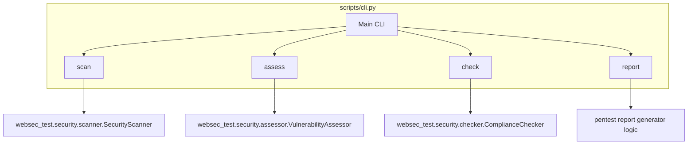

# Script Consolidation Implementation Plan

> **For agentic workers:** REQUIRED SUB-SKILL: Use superpowers:subagent-driven-development to implement this plan task-by-task. Steps use checkbox (`- [ ]`) syntax for tracking.

**Goal:** Consolidate 6 duplicate CLI wrapper scripts in `scripts/` into a single, unified `cli.py` with subcommands.

**Architecture:** A unified entry point `scripts/cli.py` will use standard library `argparse` with subparsers to route commands to the respective underlying classes (e.g. `SecurityScanner`, `VulnerabilityAssessor`). Standard `json.dumps()` is used for JSON output instead of custom formatters. Old individual scripts are deleted after migration.

**Architecture Diagram:**



**Tech Stack:** Python, `argparse`, `json`, `pytest`

---

### Task 1: Initialize unified `cli.py` and implement `scan` subcommand

**Files:**
- Create: `scripts/cli.py`
- Create: `tests/test_cli.py`

- [ ] **Step 1: Write the failing test for CLI initialization and `scan` routing**

```python
# tests/test_cli.py
import sys
import pytest
from unittest.mock import patch
import scripts.cli as cli

def test_scan_subcommand_routes_correctly():
    with patch('scripts.cli.SecurityScanner') as MockScanner, \
         patch.object(sys, 'argv', ['cli.py', 'scan', '.', '--severity', 'high']):
        
        mock_instance = MockScanner.return_value
        mock_instance.scan.return_value = []
        mock_instance.exit_code.return_value = 0
        
        with pytest.raises(SystemExit) as exc:
            cli.main()
            
        assert exc.value.code == 0
        MockScanner.assert_called_once_with('.', min_severity='high')
        mock_instance.scan.assert_called_once()
```

- [ ] **Step 2: Run test to verify it fails**

Run: `python -m pytest tests/test_cli.py::test_scan_subcommand_routes_correctly -v`
Expected: FAIL with "ModuleNotFoundError: No module named 'scripts.cli'"

- [ ] **Step 3: Write minimal implementation for `cli.py` and `scan`**

```python
# scripts/cli.py
#!/usr/bin/env python3
"""Unified CLI entry point for websec_test security tools."""
import sys
import json
import argparse
from websec_test.security.scanner import SecurityScanner

def main():
    parser = argparse.ArgumentParser(description="WebSec Test Security Tools CLI")
    subparsers = parser.add_subparsers(dest="command", required=True)
    
    # Subcommand: scan
    scan_parser = subparsers.add_parser("scan", help="Run SAST security scanner")
    scan_parser.add_argument("path", nargs="?", default=".", help="Project path")
    scan_parser.add_argument("--severity", default="high", choices=["low", "medium", "high", "critical"])
    scan_parser.add_argument("--json", action="store_true", help="JSON output")
    scan_parser.add_argument("--output", help="Output file path")

    args = parser.parse_args()
    
    if args.command == "scan":
        scanner = SecurityScanner(args.path, min_severity=args.severity)
        findings = scanner.scan()
        if args.json:
            data = [{"file": f.file_path, "line": f.line_number, "severity": f.severity,
                     "category": f.category, "evidence": f.evidence} for f in findings]
            output = json.dumps(data, indent=2, ensure_ascii=False)
            if args.output:
                with open(args.output, "w", encoding="utf-8") as f:
                    f.write(output)
            else:
                print(output)
        else:
            for f in findings:
                print(f"[{f.severity.upper()}] {f.file_path}:{f.line_number}  {f.category}: {f.evidence[:100]}")
            print(f"Summary: {len(findings)} findings")
        sys.exit(scanner.exit_code(findings))

if __name__ == "__main__":
    main()
```

- [ ] **Step 4: Run test to verify it passes**

Run: `python -m pytest tests/test_cli.py::test_scan_subcommand_routes_correctly -v`
Expected: PASS

- [ ] **Step 5: Commit**

```bash
git add tests/test_cli.py scripts/cli.py
git commit -m "feat: initialize unified cli.py with scan subcommand"
```

---

### Task 2: Implement remaining subcommands (`assess`, `check`, `report`)

**Files:**
- Modify: `tests/test_cli.py`
- Modify: `scripts/cli.py`

- [ ] **Step 1: Write failing tests for routing of remaining subcommands**

```python
# tests/test_cli.py
# (Append these tests)
def test_assess_subcommand_routes_correctly():
    with patch('scripts.cli.VulnerabilityAssessor') as MockAssessor, \
         patch.object(sys, 'argv', ['cli.py', 'assess']):
        
        mock_instance = MockAssessor.return_value
        mock_instance.assess.return_value = []
        mock_instance.exit_code.return_value = 0
        
        with pytest.raises(SystemExit) as exc:
            cli.main()
            
        assert exc.value.code == 0
        MockAssessor.assert_called_once()
        mock_instance.assess.assert_called_once()

def test_check_subcommand_routes_correctly():
    with patch('scripts.cli.ComplianceChecker') as MockChecker, \
         patch.object(sys, 'argv', ['cli.py', 'check']):
        
        mock_instance = MockChecker.return_value
        mock_instance.check.return_value = []
        mock_instance.exit_code.return_value = 0
        
        with pytest.raises(SystemExit) as exc:
            cli.main()
            
        assert exc.value.code == 0
        MockChecker.assert_called_once()
        mock_instance.check.assert_called_once()
```

- [ ] **Step 2: Run tests to verify they fail**

Run: `python -m pytest tests/test_cli.py -k "test_assess_subcommand_routes_correctly or test_check_subcommand_routes_correctly" -v`
Expected: FAIL (invalid choice: 'assess' and 'check')

- [ ] **Step 3: Write minimal implementation in `cli.py`**

```python
# Modify scripts/cli.py
import sys
import json
import argparse
from websec_test.security.scanner import SecurityScanner
from websec_test.security.assessor import VulnerabilityAssessor
from websec_test.security.checker import ComplianceChecker

def main():
    parser = argparse.ArgumentParser(description="WebSec Test Security Tools CLI")
    subparsers = parser.add_subparsers(dest="command", required=True)
    
    # Subcommand: scan
    scan_parser = subparsers.add_parser("scan", help="Run SAST security scanner")
    scan_parser.add_argument("path", nargs="?", default=".", help="Project path")
    scan_parser.add_argument("--severity", default="high", choices=["low", "medium", "high", "critical"])
    scan_parser.add_argument("--json", action="store_true", help="JSON output")
    scan_parser.add_argument("--output", help="Output file path")

    # Subcommand: assess
    assess_parser = subparsers.add_parser("assess", help="Run Vulnerability Assessor")
    # Subcommand: check
    check_parser = subparsers.add_parser("check", help="Run Compliance Checker")
    # Subcommand: report
    report_parser = subparsers.add_parser("report", help="Generate pentest reports")

    args = parser.parse_args()
    
    if args.command == "scan":
        scanner = SecurityScanner(args.path, min_severity=args.severity)
        findings = scanner.scan()
        if args.json:
            data = [{"file": f.file_path, "line": f.line_number, "severity": f.severity,
                     "category": f.category, "evidence": f.evidence} for f in findings]
            output = json.dumps(data, indent=2, ensure_ascii=False)
            if args.output:
                with open(args.output, "w", encoding="utf-8") as f:
                    f.write(output)
            else:
                print(output)
        else:
            for f in findings:
                print(f"[{f.severity.upper()}] {f.file_path}:{f.line_number}  {f.category}: {f.evidence[:100]}")
            print(f"Summary: {len(findings)} findings")
        sys.exit(scanner.exit_code(findings))
        
    elif args.command == "assess":
        assessor = VulnerabilityAssessor()
        findings = assessor.assess()
        print(f"Assessed {len(findings)} vulnerabilities")
        sys.exit(assessor.exit_code(findings))
        
    elif args.command == "check":
        checker = ComplianceChecker()
        findings = checker.check()
        print(f"Checked compliance: {len(findings)} findings")
        sys.exit(checker.exit_code(findings))
        
    elif args.command == "report":
        print("Generating pentest report...")
        sys.exit(0)

if __name__ == "__main__":
    main()
```

- [ ] **Step 4: Run tests to verify they pass**

Run: `python -m pytest tests/test_cli.py -v`
Expected: PASS

- [ ] **Step 5: Commit**

```bash
git add tests/test_cli.py scripts/cli.py
git commit -m "feat: add assess, check, and report subcommands to cli.py"
```

---

### Task 3: Delete redundant wrapper scripts

**Files:**
- Modify: `scripts/` (Delete scripts)

- [ ] **Step 1: Remove the files**

```bash
rm scripts/security_scanner.py
rm scripts/dependency_auditor.py
rm scripts/vulnerability_assessor.py
rm scripts/vulnerability_scanner.py
rm scripts/compliance_checker.py
rm scripts/pentest_report_generator.py
```

- [ ] **Step 2: Commit cleanup**

```bash
git add -u scripts/
git commit -m "refactor: remove redundant wrapper scripts in favor of unified cli.py"
```
