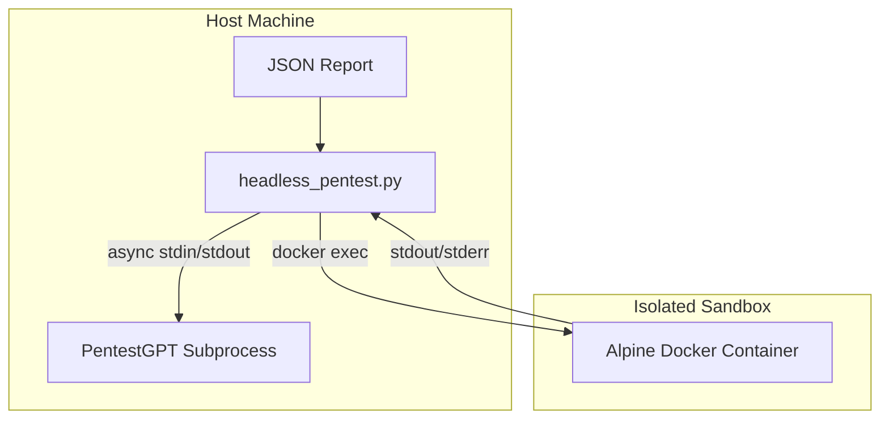

# PentestGPT Automation Test Implementation Plan

> **For agentic workers:** REQUIRED SUB-SKILL: Use superpowers:subagent-driven-development to implement this plan task-by-task. Steps use checkbox (`- [ ]`) syntax for tracking.

**Goal:** Build a secure, headless python script that integrates `websec_test` with PentestGPT via a fully automated, Docker-isolated exploit loop.

**Architecture:** The script uses `asyncio` to manage non-blocking I/O with the PentestGPT CLI. Extracted bash commands are executed strictly within an ephemeral Alpine Docker container after passing an allowlist check. ANSI escape codes are stripped from stdout to ensure reliable command extraction. Signal handlers ensure no zombie processes remain.

**Architecture Diagram:**



**Tech Stack:** Python 3.10+, `asyncio`, `subprocess`, `re`, Docker CLI.

---

### Task 1: Project Setup & Lifecycle Boilerplate

**Files:**
- Create: `Demo_auto/PentestGPT/headless_pentest.py`
- Test: `Demo_auto/PentestGPT/tests/test_lifecycle.py`

- [ ] **Step 1: Write the failing test for container lifecycle**

```python
import asyncio
import subprocess
import pytest
from headless_pentest import setup_sandbox, teardown_sandbox

@pytest.mark.asyncio
async def test_sandbox_lifecycle():
    container_id = await setup_sandbox()
    # Check if running
    result = subprocess.run(["docker", "ps", "-q", "-f", f"id={container_id}"], capture_output=True, text=True)
    assert container_id[:12] in result.stdout
    
    await teardown_sandbox(container_id)
    # Check if killed
    result = subprocess.run(["docker", "ps", "-q", "-f", f"id={container_id}"], capture_output=True, text=True)
    assert container_id[:12] not in result.stdout
```

- [ ] **Step 2: Run test to verify it fails**

Run: `pytest Demo_auto/PentestGPT/tests/test_lifecycle.py -v`
Expected: FAIL with "ModuleNotFoundError" or "setup_sandbox not defined"

- [ ] **Step 3: Write minimal implementation**

```python
import asyncio
import subprocess
import atexit
import signal

CONTAINER_NAME = "pentest_sandbox"

async def setup_sandbox() -> str:
    # Run an alpine container that sleeps forever
    proc = await asyncio.create_subprocess_exec(
        "docker", "run", "--rm", "-d", "--name", CONTAINER_NAME, "alpine", "sleep", "infinity",
        stdout=asyncio.subprocess.PIPE,
        stderr=asyncio.subprocess.PIPE
    )
    stdout, _ = await proc.communicate()
    container_id = stdout.decode().strip()
    return container_id

async def teardown_sandbox(container_id: str = CONTAINER_NAME):
    proc = await asyncio.create_subprocess_exec(
        "docker", "rm", "-f", container_id,
        stdout=asyncio.subprocess.PIPE,
        stderr=asyncio.subprocess.PIPE
    )
    await proc.communicate()

def sync_teardown():
    subprocess.run(["docker", "rm", "-f", CONTAINER_NAME], capture_output=True)

# Register safety handlers
atexit.register(sync_teardown)
signal.signal(signal.SIGINT, lambda sig, frame: sync_teardown())
signal.signal(signal.SIGTERM, lambda sig, frame: sync_teardown())
```

- [ ] **Step 4: Run test to verify it passes**

Run: `pytest Demo_auto/PentestGPT/tests/test_lifecycle.py -v`
Expected: PASS

- [ ] **Step 5: Commit**

```bash
git add Demo_auto/PentestGPT/headless_pentest.py Demo_auto/PentestGPT/tests/test_lifecycle.py
git commit -m "feat: setup docker sandbox lifecycle management"
```

---

### Task 2: I/O Sanitization & Command Extraction

**Files:**
- Modify: `Demo_auto/PentestGPT/headless_pentest.py:35`
- Test: `Demo_auto/PentestGPT/tests/test_sanitization.py`

- [ ] **Step 1: Write the failing test**

```python
from headless_pentest import strip_ansi, extract_command, sanitize_json_report

def test_strip_ansi():
    raw = "\x1b[92m```bash\x1b[0m\nls -la\n```"
    assert strip_ansi(raw) == "```bash\nls -la\n```"

def test_extract_command():
    text = "Here is the command:\n```bash\ncurl http://target\n```"
    assert extract_command(text) == "curl http://target"
    
def test_sanitize_json():
    raw_json = '{"url": "/test", "raw_response": "HTTP/1.1 200 OK\\n\\n<script>alert(1)</script>"}'
    sanitized = sanitize_json_report(raw_json)
    assert "raw_response" not in sanitized or "alert" not in sanitized
```

- [ ] **Step 2: Run test to verify it fails**

Run: `pytest Demo_auto/PentestGPT/tests/test_sanitization.py -v`
Expected: FAIL with undefined functions.

- [ ] **Step 3: Write minimal implementation**

```python
import re
import json

def strip_ansi(text: str) -> str:
    ansi_escape = re.compile(r'\x1B(?:[@-Z\\-_]|\[[0-?]*[ -/]*[@-~])')
    return ansi_escape.sub('', text)

def extract_command(text: str) -> str | None:
    match = re.search(r'```(?:bash|sh|shell)?\n(.*?)```', text, re.DOTALL)
    if match:
        return match.group(1).strip()
    return None

def sanitize_json_report(json_str: str) -> str:
    try:
        data = json.loads(json_str)
        if isinstance(data, dict):
            # Remove raw responses that could harbor prompt injections
            data.pop("raw_response", None)
            data.pop("response_body", None)
        return json.dumps(data)
    except json.JSONDecodeError:
        return json_str
```

- [ ] **Step 4: Run test to verify it passes**

Run: `pytest Demo_auto/PentestGPT/tests/test_sanitization.py -v`
Expected: PASS

- [ ] **Step 5: Commit**

```bash
git add Demo_auto/PentestGPT/headless_pentest.py Demo_auto/PentestGPT/tests/test_sanitization.py
git commit -m "feat: add ansi stripping and json sanitization"
```

---

### Task 3: Command Allowlisting & Sandbox Execution

**Files:**
- Modify: `Demo_auto/PentestGPT/headless_pentest.py:58`
- Test: `Demo_auto/PentestGPT/tests/test_execution.py`

- [ ] **Step 1: Write the failing test**

```python
import pytest
from headless_pentest import is_allowed_command, execute_in_sandbox

def test_allowlist():
    assert is_allowed_command("curl http://example.com") == True
    assert is_allowed_command("rm -rf /") == False
    assert is_allowed_command("echo hello | base64 -d | sh") == False

@pytest.mark.asyncio
async def test_execute_in_sandbox():
    out, err = await execute_in_sandbox("echo test_exec")
    assert "test_exec" in out
```

- [ ] **Step 2: Run test to verify it fails**

Run: `pytest Demo_auto/PentestGPT/tests/test_execution.py -v`
Expected: FAIL with undefined functions.

- [ ] **Step 3: Write minimal implementation**

```python
ALLOWED_BINARIES = {"curl", "nmap", "ffuf", "python3", "ls", "cat", "echo", "ping"}

def is_allowed_command(command: str) -> bool:
    # Reject shell piping or chaining to prevent bypass
    if any(char in command for char in ['|', '>', '<', '&', ';']):
        return False
    parts = command.strip().split()
    if not parts:
        return False
    base_binary = parts[0]
    return base_binary in ALLOWED_BINARIES

async def execute_in_sandbox(command: str, timeout: int = 30) -> tuple[str, str]:
    if not is_allowed_command(command):
        return "", "Command rejected: binary not permitted or uses shell operators."
    
    try:
        proc = await asyncio.create_subprocess_exec(
            "docker", "exec", CONTAINER_NAME, "sh", "-c", command,
            stdout=asyncio.subprocess.PIPE,
            stderr=asyncio.subprocess.PIPE
        )
        stdout, stderr = await asyncio.wait_for(proc.communicate(), timeout=timeout)
        return stdout.decode(), stderr.decode()
    except asyncio.TimeoutError:
        proc.kill()
        return "", "Command timed out."
```

- [ ] **Step 4: Run test to verify it passes**

Run: `pytest Demo_auto/PentestGPT/tests/test_execution.py -v`
Expected: PASS (Requires `setup_sandbox` to be called first in a fixture, you may need to adjust the test or ensure container is running).

- [ ] **Step 5: Commit**

```bash
git add Demo_auto/PentestGPT/headless_pentest.py Demo_auto/PentestGPT/tests/test_execution.py
git commit -m "feat: implement allowlist and docker execution"
```

---

### Task 4: The Autonomous Async Loop

**Files:**
- Modify: `Demo_auto/PentestGPT/headless_pentest.py:85`

- [ ] **Step 1: Write the Core Loop implementation**

```python
import sys

async def run_pentest_loop(report_path: str):
    await setup_sandbox()
    
    with open(report_path, 'r') as f:
        sanitized_json = sanitize_json_report(f.read())
        
    pentest_cmd = [
        "uv", "run", "pentestgpt-legacy", 
        "--reasoning-model", "ollama:qwen2.5-coder:1.5b", 
        "--parsing-model", "ollama:qwen2.5-coder:1.5b", 
        "--base-url", "http://localhost:11434/v1"
    ]
    
    llm_proc = await asyncio.create_subprocess_exec(
        *pentest_cmd,
        stdin=asyncio.subprocess.PIPE,
        stdout=asyncio.subprocess.PIPE,
        stderr=asyncio.subprocess.PIPE
    )
    
    # Register llm_proc cleanup
    atexit.register(lambda: llm_proc.kill() if llm_proc.returncode is None else None)
    
    initial_prompt = f"Here is a vulnerability report. What should we do first?\n```json\n{sanitized_json}\n```\n"
    llm_proc.stdin.write(initial_prompt.encode())
    await llm_proc.stdin.drain()
    
    buffer = ""
    iterations = 0
    MAX_ITER = 15
    
    while iterations < MAX_ITER:
        line = await llm_proc.stdout.readline()
        if not line:
            break
            
        decoded_line = strip_ansi(line.decode())
        buffer += decoded_line
        sys.stdout.write(decoded_line) # Mirror to console
        sys.stdout.flush()
        
        command = extract_command(buffer)
        if command:
            print(f"\n[+] Executing: {command}\n")
            out, err = await execute_in_sandbox(command)
            
            response_prompt = f"Command output:\n{out}\nError:\n{err}\nWhat is our next step?\n"
            llm_proc.stdin.write(response_prompt.encode())
            await llm_proc.stdin.drain()
            
            buffer = "" # Reset buffer
            iterations += 1
            
        if "Exploit successful" in buffer or "Task complete" in buffer:
            print("\n[!] Success criteria met. Exiting.\n")
            break

    llm_proc.terminate()
    await teardown_sandbox()

if __name__ == "__main__":
    if len(sys.argv) < 2:
        print("Usage: python headless_pentest.py <report.json>")
        sys.exit(1)
    asyncio.run(run_pentest_loop(sys.argv[1]))
```

- [ ] **Step 2: Dry Run Check**

Run: `python Demo_auto/PentestGPT/headless_pentest.py dummy.json` (with a dummy json file)
Expected: Should attempt to start docker, run PentestGPT, and exit cleanly on EOF or error.

- [ ] **Step 3: Commit**

```bash
git add Demo_auto/PentestGPT/headless_pentest.py
git commit -m "feat: implement main autonomous async loop"
```
