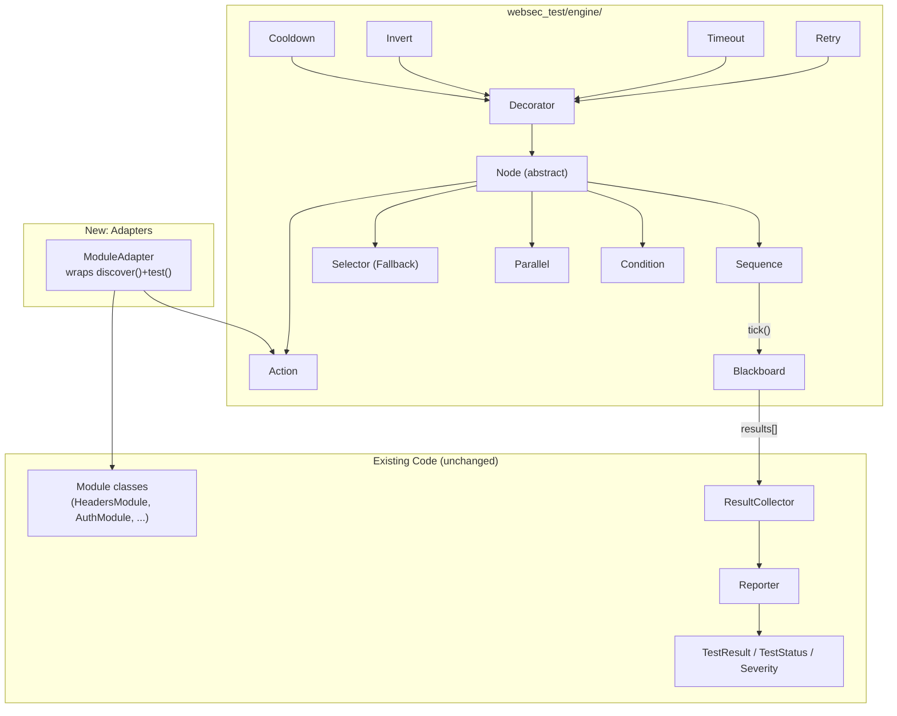

## Problem Statement

The current WebSec Test execution model is an implicit sequential loop: `main.py` iterates `ALL_MODULES`, calls `discover()` then `test()` on each, and collects flat `TestResult[]`. This works, but it's rigid:

- No way to express conditional execution ("skip X if Y failed")
- No fallback logic ("try auth, if that fails try disclosure")
- No parallel execution for independent passive checks
- No retry logic for flaky network conditions
- No timeout wrapping per-module
- The flow is buried in `main.py` — not inspectable, not configurable, not reusable

We need an explicit, composable execution model that supports all these patterns without rewriting the existing module code.

## Constraints

- **Zero changes to existing module classes** — `HeadersModule`, `AuthModule`, etc. stay exactly as they are
- **Zero changes to existing result model** — `TestResult`, `TestStatus`, `Severity` remain
- **Zero new Python dependencies** — stdlib only for the engine
- **All 151 existing tests must still pass** — new code is additive
- **Trees are declared in Python code** — no config/JSON DSLs
- **Support all standard BT node types** — Sequence, Selector, Parallel, Condition, Action, Decorators (Retry, Timeout, Invert, Cooldown, Log)

## Approach

Build a lightweight Behavior Tree engine in a new `websec_test/engine/` package. Trees are composed in Python using node constructors. Existing modules are wrapped via `ModuleAdapter` — a bridge node that calls `discover()` + `test()` through the standard BT interface. Individual check-level BTs use new leaf Action nodes.

## Architecture



## Components

### File Layout

```
websec_test/engine/
├── __init__.py        # Public API: BehaviorTree, Blackboard, NodeStatus
├── nodes.py           # Node base class + composite nodes (Sequence, Selector, Parallel)
├── leaves.py          # Action, Condition
├── decorators.py      # Retry, Timeout, Invert, Cooldown, Log
└── adapters.py        # ModuleAdapter — wraps existing module classes
```

### core.py — NodeStatus & Blackboard

```python
class NodeStatus(Enum):
    SUCCESS = "success"
    FAILURE = "failure"
    RUNNING = "running"   # reserved for future async use

@dataclass
class Blackboard:
    client: SessionClient
    target: str
    results: list[TestResult] = field(default_factory=list)
    _store: dict = field(default_factory=dict)

    def add_result(self, result: TestResult): ...
    def get(self, key: str, default=None): ...
    def set(self, key: str, value): ...
```

### nodes.py — Node base + composites

**Node** (abstract) — `tick(blackboard) -> NodeStatus`. Every node type inherits from this.

**Sequence** — runs children left-to-right. Returns SUCCESS if all succeed, FAILURE on first failure (short-circuits).

**Selector** (Fallback) — runs children left-to-right. Returns SUCCESS on first success (short-circuits). FAILURE if all fail.

**Parallel** — runs all children (order unspecified). Takes `min_success` parameter. Returns SUCCESS if ≥ N children succeed. FAILURE otherwise.

### leaves.py — Leaf nodes

**Action** — concrete leaf with a `tick()` implementation. Has full access to `blackboard.client` and `blackboard.target`. The primary unit of test execution at the individual check level.

**Condition** — leaf that reads blackboard state and returns SUCCESS/FAILURE based on a predicate. No side effects.

### decorators.py — Wrappers

| Decorator | Parameter | Behavior |
|---|---|---|
| Retry | max_attempts, delay | Re-ticks child on FAILURE up to N times |
| Timeout | max_seconds | Raises/catches timeout, returns FAILURE |
| Invert | — | Flips child's SUCCESS ↔ FAILURE |
| Cooldown | min_interval | Skips child if ticked within T seconds |
| Log | label | Logs entry/exit + duration, passes status through |

### adapters.py — Bridge to existing modules

**ModuleAdapter** wraps any existing module class into an Action node:

- `tick()` calls `module.discover(client, target)` → stores endpoints on blackboard
- Calls `module.test(client, target, endpoints)` → appends each `TestResult` to `blackboard.results`
- Returns SUCCESS if no failures/errors, FAILURE otherwise
- Catches exceptions and converts to ERROR `TestResult`

## Data Flow

```
main.py creates Blackboard(client, target)
  → ticks root tree node (typically a Sequence)
    → Sequence ticks child 1 (ModuleAdapter for headers)
      → ModuleAdapter.tick():
          → discover() → endpoints
          → test() → TestResult[]
          → blackboard.add_result() for each
          → returns SUCCESS/FAILURE
    → Sequence ticks child 2 (Selector for auth/disclosure fallback)
      → Selector ticks ModuleAdapter(auth)
        → on FAILURE, Selector ticks ModuleAdapter(disclosure)
      → returns result
    → Sequence ticks child 3 (Parallel for passive checks)
      → ticks all children concurrently
      → returns SUCCESS if ≥ min_success succeed
  → root tick completes
  → blackboard.results → existing ResultCollector → existing Reporter
```

## Integration with main.py

The `build_tree()` function replaces the current module iteration loop:

```python
def build_tree(module_names: list[str], args) -> Node:
    """Build a default tree from a list of module names."""
    nodes = []
    for name in module_names:
        module = create_module(name, args)
        nodes.append(ModuleAdapter(name, module))
    return Sequence("websec_scan", children=nodes)

# In run():
root = build_tree(modules_to_run, args)
blackboard = Blackboard(client=client, target=target)
root.tick(blackboard)

# Existing collector/reporter — unchanged
collector = ResultCollector()
for r in blackboard.results:
    collector.add(r)
reporter = Reporter(collector, target=target, duration=duration)
```

Custom trees can be built by composing nodes directly — no need for `build_tree()`:

```python
root = Sequence("custom_scan", children=[
    ModuleAdapter("headers", HeadersModule()),
    Retry("auth_retry", max_attempts=3, child=ModuleAdapter("auth", AuthModule(creds))),
    Parallel("passive", min_success=2, children=[
        ModuleAdapter("cors", CorsModule()),
        ModuleAdapter("cookies", CookiesModule()),
    ]),
])
```

## Error Handling

| Scenario | Behavior |
|---|---|
| Module raises exception | ModuleAdapter catches, creates ERROR TestResult, returns FAILURE |
| Network timeout | ModuleAdapter returns FAILURE (child of Retry decorator → retried) |
| Invalid tree structure | RuntimeError at construction time (e.g., wrong child type) |
| Blackboard key collision | Last write wins. Nodes should scope keys by module name |
| Parallel child exception | Caught per-child. Other children still run. Child result = FAILURE |
| Retry exhausted | Returns FAILURE after max_attempts |
| Timeout exceeded | Returns FAILURE |

## Testing Strategy

### Engine unit tests (~25 tests)

| Test file | Tests |
|---|---|
| `tests/test_bt_nodes.py` | Sequence (all succeed, short-circuit), Selector (first success, all fail), Parallel (meets threshold, fails threshold) |
| `tests/test_bt_decorators.py` | Retry (succeeds after retry, exhausts), Timeout (child exceeds), Invert, Cooldown, Log |
| `tests/test_bt_blackboard.py` | Read/write, add_result, key scoping, isolation |
| `tests/test_bt_adapters.py` | ModuleAdapter wraps module, results collected, exception handling |

### Integration tests (~5 tests)

| Test file | Tests |
|---|---|
| `tests/test_bt_integration.py` | Full tree with all 10 modules, mock HTTP, verify results match expected count and structure |

Existing 151 tests remain untouched — they test module logic, not tree execution.

## Open Questions

- **Parallel execution strategy:** For Phase 1, Parallel runs children sequentially within a single thread (order is undefined but non-concurrent). True async parallelism (thread pool) can be added later without changing the node API.
- **ModuleAdapter success semantics:** Currently returns FAILURE if any check in the module fails. An alternative is "FAILURE only if the module crashed" vs "FAILURE if any check failed". Going with "any failure/error → FAILURE" for now — this is the most conservative and lets Selector/Sequence handle it.
- **Check-level BTs:** Phase 1 focuses on module-orchestration-level trees. Individual check BTs (e.g., modeling an auth bypass attempt as a tree of probe→analyze→decide) are deferred to Phase 2.
